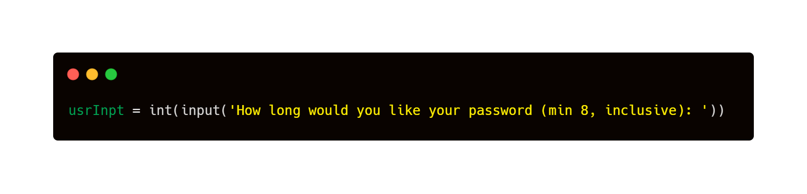
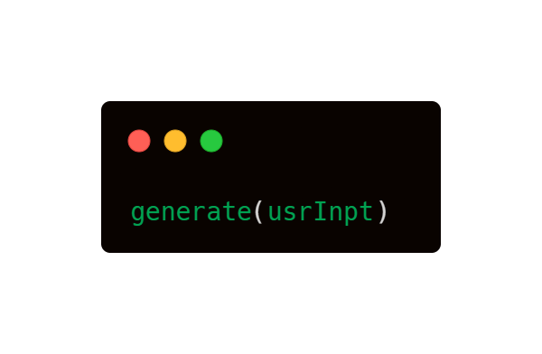

# Password Generator

This code generates a random and secure password of specified length. It includes a combination of lowercase letters, uppercase letters, symbols, and numbers in a random order, ensuring that the password is strong and difficult to guess. The password is generated by shuffling and reversing the combination of elements, providing an added layer of security.

## Usage

The length of the password must be specified by the user and it must be a minimum of 8 characters long.

 
To generate a password, call the generate() function and pass in the desired password length as an argument.

 
The generated password will be displayed in the console, ready to be copied and used.

# Features
The code generates a password that includes a variety of characters, including:

- Lowercase letters (a-z)
- Uppercase letters (A-Z)
- Numbers (0-9)
- Symbols (~!@#$%^&*()_-+={}[]\';:\"<>,.?/|)

The password is generated by dividing the desired length by 4, ensuring that each type of character is included in the password. The result is then shuffled and reversed to add an additional layer of security.

# Requirements
The code was written in Python 3 and does not require any external libraries. Simply run the code in a Python 3 environment to generate a secure password.
